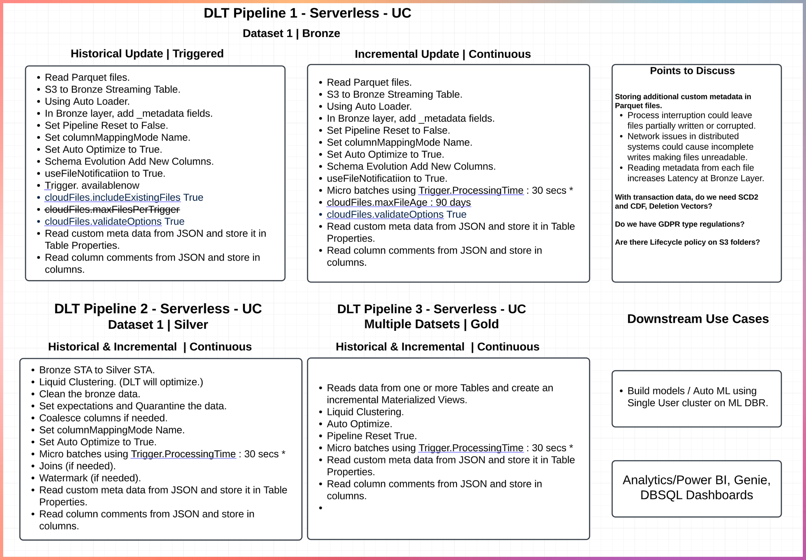

# Getting started

<!--  -->

## To deploy a development copy of this project

```
databricks bundle deploy --target dev
```

## To run the Bronze onetime backfill pipeline

```
databricks bundle run -t dev bronze_citi_bike_onetime_backfill_pipeline
```

## To run the Bronze continuous pipeline

```
databricks bundle run -t dev bronze_citi_bike_continuous_pipeline
```

## To run the Silver pipeline

```
databricks bundle run -t dev silver_citi_bike_pipeline
```

## To run the Gold pipeline

```
databricks bundle run -t dev gold_citi_bike_pipeline
```

